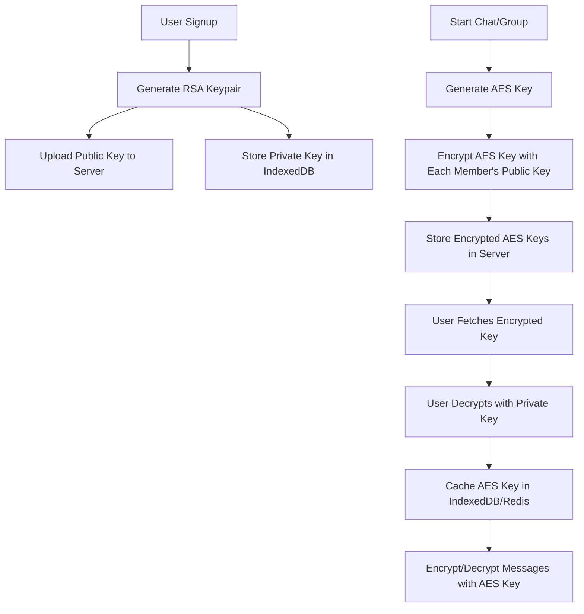

# Encryption Documentation

## 1. Key Generation

- **User Keypair:**  
  - On signup, each user generates an RSA keypair (public/private) in the browser.
  - The **public key** is uploaded and stored on the server (`user_encryption_keys` table).
  - The **private key** never leaves the client (browser/IndexedDB).

- **Chat/Group Key:**  
  - For each chat (personal or group), a unique AES-256-GCM symmetric key is generated (usually by the chat creator or server).

## 2. Key Encryption & Storage

- **Per-User Encryption:**  
  - The chat/group AES key is encrypted separately for each member using their public RSA key.
  - These encrypted keys are stored in the `chat_session_keys` table, with one row per user per chat/group.

- **Client Storage:**  
  - After a user decrypts the AES key (using their private key), it is cached in the browser’s IndexedDB (and sometimes in localStorage or memory for quick access).

- **Server Storage:**  
  - The server only stores encrypted message blobs and the encrypted AES keys.
  - The server never has access to the decrypted AES keys or user private keys.

## 3. Key Retrieval

- **On Message Send/Receive:**  
  - The client retrieves the AES key for the chat from IndexedDB.
  - If not present, it fetches the encrypted key from the server, decrypts it with the user’s private key, and caches it locally.

- **Redis Caching:**  
  - For performance, decrypted AES keys may be cached in Redis (`key_cache:{userId}:{chatId}`) with a short TTL (5 minutes) for backend operations (e.g., media encryption).

## 4. Message Encryption/Decryption

- **Sending:**  
  - The client generates a random IV (12 bytes).
  - The message is encrypted using AES-256-GCM with the chat’s AES key and IV.
  - The encrypted content, IV, and auth tag are sent to the server.

- **Receiving:**  
  - The client retrieves the AES key and IV, then decrypts the message using AES-256-GCM.

## 5. Key Rotation

- **Versioning:**  
  - Each chat key has a version (`key_version:{chatId}` in Redis, `encrypted_with_key_version` in DB).
  - On rotation, a new AES key is generated and re-encrypted for all members.

## 6. Security Notes

- **Private keys are never sent to the server.**
- **All encryption/decryption happens client-side.**
- **Server only stores encrypted data and public keys.**

---

## Summary Table

| Step                | Where/How Created         | Where Stored                | When Retrieved/Used         |
|---------------------|--------------------------|-----------------------------|-----------------------------|
| User RSA Keypair    | Client (on signup)       | Public: Server, Private: Client | On login, for key exchange  |
| Chat AES Key        | Client/Server (chat start)| Encrypted: Server (per user) | On joining chat, message send/receive |
| Decrypted AES Key   | Client (after decrypt)   | IndexedDB, Redis (cache)    | On every message operation  |

---

## Visual Diagram

---

## Example Flows

### Personal Chat (Known Mode)
1. User A generates random AES key for chat.
2. A fetches B's public RSA key from server.
3. A encrypts symmetric key with B's public key.
4. A sends chat request with encrypted keys.
5. Server stores encrypted keys.
6. B receives notification, decrypts symmetric key with private key.
7. Both can now encrypt/decrypt messages.

### Group Chat
1. Creator generates group symmetric key.
2. For each member, encrypts group key with their public RSA key.
3. Server stores encrypted keys.
4. New members get encrypted key from server, decrypt with private key.

---

## Redis Structures
- `key_cache:{userId}:{chatId}`: Decrypted AES key cache (TTL: 5 min)
- `key_version:{chatId}`: Current key version (TTL: 30 days)

---

## Security Principles
- End-to-end encryption: Only clients can decrypt messages.
- Server cannot read message content.
- Key rotation supported for forward secrecy.

---

*For more details, see the code and SQL schema in the repository.*
*Even if you don't get it, then believe me it's not for you.*
